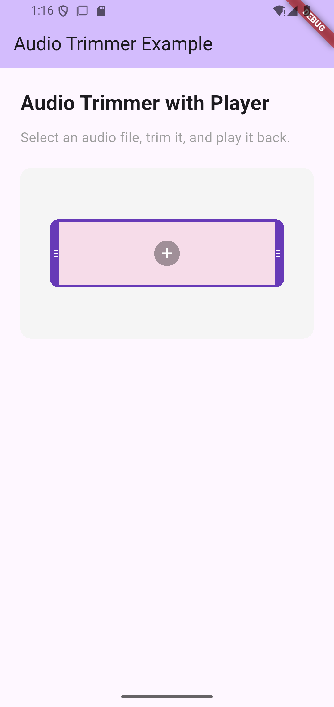
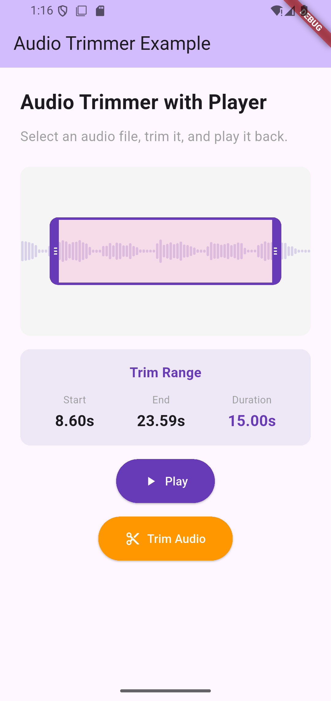

<div align="center">

# 🎵 Audio Trimmer Plus

[](https://pub.dev/packages/audio_trimmer_plus)
[](https://opensource.org/licenses/MIT)
[](https://flutter.dev)
[](https://dart.dev)

**Beautiful, customizable audio trimming widgets for Flutter**  
*Create stunning audio editing interfaces with waveform visualization, playback control, and frame-accurate trimming*

[Installation](#-installation) •
[Quick Start](#-quick-start) •
[Features](#-features) •
[Examples](#-examples) •
[API Reference](#-api-reference)

</div>

---

## 📸 Screenshots

<p align="center">
  
  
</p>

---

## ✨ Features

- 🎵 **Complete Audio Editor** - All-in-one widget with file picker, waveform display, and trim controls
- ✂️ **Frame-Accurate Trimming** - Precise audio trimming with FFmpeg integration
- 🎮 **Playback Control** - Built-in play/pause with automatic end position stopping
- 🔊 **Waveform Visualization** - Automatic waveform extraction with customizable appearance
- 📁 **File Management** - Built-in file import with validation support
- 🎨 **Fully Customizable** - Configure colors, sizes, borders, and more
- 🎯 **Easy to Use** - Simple API with sensible defaults
- 🔄 **Animated Progress** - Smooth progress animations during playback
- 🎼 **Format Support** - WAV, MP3, M4A, and other audio formats
- 📱 **Responsive** - Adapts to different screen sizes
- ⚡ **Performance Optimized** - Smooth scrolling and rendering
- 🪶 **Lightweight** - Minimal dependencies

---

## 📦 Installation

Add this to your package's `pubspec.yaml` file:

```yaml
dependencies:
  audio_trimmer_plus: ^0.0.1
  audio_waveforms: ^2.0.2  # Required for waveform visualization
  ffmpeg_kit_flutter_new: ^4.1.0  # Required for audio trimming
  file_picker: ^8.1.6  # Required for file selection
```

Or run:

```bash
flutter pub add audio_trimmer_plus
flutter pub add audio_waveforms
flutter pub add ffmpeg_kit_flutter_new
flutter pub add file_picker
```

---

## 🚀 Quick Start

### 1. Import the Package

```dart
import 'package:audio_trimmer_plus/audio_trimmer_plus.dart';
import 'package:file_picker/file_picker.dart';
```

### 2. Create a Controller

```dart
final _trimmerController = AudioTrimmerController();
```

### 3. Build the UI

```dart
AudioTrimWidget(
  onTap: () async {
    // Pick and import audio file
    final result = await FilePicker.platform.pickFiles(type: FileType.audio);
    if (result?.files.single.path != null) {
      await _trimmerController.importFile(result!.files.single.path!);
    }
  },
  trimmerController: _trimmerController,
  onTrimRangeChanged: (startMs, endMs) {
    print('Trim range: $startMs - $endMs ms');
  },
)
```

### 4. Dispose When Done

```dart
@override
void dispose() {
  _trimmerController.dispose();
  super.dispose();
}
```

That's it! Your audio trimmer is ready. 🎉

---

## 📚 Examples

### Basic Audio Trimmer with Playback

```dart
import 'package:flutter/material.dart';
import 'package:audio_trimmer_plus/audio_trimmer_plus.dart';
import 'package:audio_waveforms/audio_waveforms.dart';
import 'package:file_picker/file_picker.dart';

class AudioTrimmerDemo extends StatefulWidget {
  const AudioTrimmerDemo({super.key});

  @override
  State<AudioTrimmerDemo> createState() => _AudioTrimmerDemoState();
}

class _AudioTrimmerDemoState extends State<AudioTrimmerDemo> {
  final _trimmerController = AudioTrimmerController();
  bool _isPlaying = false;
  int? _startMs;
  int? _endMs;

  Future<void> _pickAudio() async {
    final result = await FilePicker.platform.pickFiles(
      type: FileType.audio,
      allowMultiple: false,
    );
    
    if (result?.files.single.path != null) {
      await _trimmerController.importFile(result!.files.single.path!);
    }
  }

  @override
  void dispose() {
    _trimmerController.dispose();
    super.dispose();
  }

  @override
  Widget build(BuildContext context) {
    return Scaffold(
      appBar: AppBar(title: const Text('Audio Trimmer')),
      body: Padding(
        padding: const EdgeInsets.all(16.0),
        child: Column(
          children: [
            Container(
              height: 200,
              decoration: BoxDecoration(
                color: Colors.grey[100],
                borderRadius: BorderRadius.circular(12),
              ),
              child: AudioTrimWidget(
                onTap: _pickAudio,
                trimmerController: _trimmerController,
                onPlayerStateChanged: (state) {
                  setState(() {
                    _isPlaying = state == PlayerState.playing;
                  });
                },
                onTrimRangeChanged: (startMs, endMs) {
                  setState(() {
                    _startMs = startMs;
                    _endMs = endMs;
                  });
                },
              ),
            ),
            const SizedBox(height: 16),
            if (_startMs != null && _endMs != null)
              Text(
                'Range: ${(_startMs! / 1000).toStringAsFixed(2)}s - ${(_endMs! / 1000).toStringAsFixed(2)}s',
                style: const TextStyle(fontSize: 16),
              ),
            const SizedBox(height: 16),
            ElevatedButton.icon(
              onPressed: () {
                if (_isPlaying) {
                  _trimmerController.pause();
                } else {
                  _trimmerController.play();
                }
              },
              icon: Icon(_isPlaying ? Icons.pause : Icons.play_arrow),
              label: Text(_isPlaying ? 'Pause' : 'Play'),
            ),
          ],
        ),
      ),
    );
  }
}
```

### Custom Styling

Create a beautifully styled audio trimmer:

```dart
AudioTrimWidget(
  onTap: _pickAudio,
  trimmerController: _trimmerController,
  config: const AudioTrimmerConfig(
    borderColor: Colors.deepPurple,
    borderWidth: 3.0,
    borderRadius: 12.0,
    tintColor: Color(0x20673AB7),
    handleColor: Colors.deepPurple,
    handleWidth: 10.0,
    progressColor: Color(0x80673AB7),
  ),
  fixedWaveColor: Colors.deepPurple.withOpacity(0.2),
  scaleFactor: 500.0,
  waveSpacing: 4.0,
  onTrimRangeChanged: (startMs, endMs) {
    print('Trim: $startMs - $endMs ms');
  },
)
```

### Complete Example with Trimming

Full implementation with file import, playback, and trimming:

```dart
class AudioEditorPage extends StatefulWidget {
  const AudioEditorPage({super.key});

  @override
  State<AudioEditorPage> createState() => _AudioEditorPageState();
}

class _AudioEditorPageState extends State<AudioEditorPage> {
  final _trimmerController = AudioTrimmerController();
  bool _isPlaying = false;
  bool _isTrimming = false;
  int? _startMs;
  int? _endMs;

  Future<void> _pickAudio() async {
    final result = await FilePicker.platform.pickFiles(
      type: FileType.audio,
      allowMultiple: false,
    );
    
    if (result?.files.single.path != null) {
      await _trimmerController.importFile(result!.files.single.path!);
    }
  }

  Future<void> _trimAudio() async {
    if (_startMs == null || _endMs == null) return;

    setState(() => _isTrimming = true);
    
    try {
      // Trim the audio using the current trim range
      final outputPath = await _trimmerController.trim();
      
      if (mounted) {
        ScaffoldMessenger.of(context).showSnackBar(
          const SnackBar(
            content: Text('Audio trimmed successfully!'),
            backgroundColor: Colors.green,
          ),
        );
        
        // Load the trimmed file back for preview
        await _trimmerController.importFile(outputPath);
      }
    } catch (e) {
      if (mounted) {
        ScaffoldMessenger.of(context).showSnackBar(
          SnackBar(
            content: Text('Error: $e'),
            backgroundColor: Colors.red,
          ),
        );
      }
    } finally {
      if (mounted) {
        setState(() => _isTrimming = false);
      }
    }
  }

  @override
  void dispose() {
    _trimmerController.dispose();
    super.dispose();
  }

  @override
  Widget build(BuildContext context) {
    return Scaffold(
      appBar: AppBar(title: const Text('Audio Editor')),
      body: Padding(
        padding: const EdgeInsets.all(24.0),
        child: Column(
          crossAxisAlignment: CrossAxisAlignment.stretch,
          children: [
            Container(
              height: 200,
              decoration: BoxDecoration(
                color: Colors.grey[100],
                borderRadius: BorderRadius.circular(12),
              ),
              child: AudioTrimWidget(
                onTap: _pickAudio,
                trimmerController: _trimmerController,
                onPlayerStateChanged: (state) {
                  setState(() {
                    _isPlaying = state == PlayerState.playing;
                  });
                },
                config: const AudioTrimmerConfig(
                  borderColor: Colors.deepPurple,
                  handleColor: Colors.deepPurple,
                  progressColor: Color(0x80673AB7),
                ),
                fixedWaveColor: Colors.deepPurple.withOpacity(0.2),
                scaleFactor: 500.0,
                waveSpacing: 4.0,
                onTrimRangeChanged: (startMs, endMs) {
                  setState(() {
                    _startMs = startMs;
                    _endMs = endMs;
                  });
                },
              ),
            ),
            const SizedBox(height: 24),
            
            // Trim range info
            if (_startMs != null && _endMs != null)
              Container(
                padding: const EdgeInsets.all(16),
                decoration: BoxDecoration(
                  color: Colors.deepPurple[50],
                  borderRadius: BorderRadius.circular(12),
                ),
                child: Column(
                  children: [
                    const Text(
                      'Trim Range',
                      style: TextStyle(
                        fontSize: 16,
                        fontWeight: FontWeight.bold,
                      ),
                    ),
                    const SizedBox(height: 8),
                    Text(
                      '${(_startMs! / 1000).toStringAsFixed(2)}s - ${(_endMs! / 1000).toStringAsFixed(2)}s',
                      style: const TextStyle(fontSize: 18),
                    ),
                    Text(
                      'Duration: ${((_endMs! - _startMs!) / 1000).toStringAsFixed(2)}s',
                      style: const TextStyle(
                        fontSize: 14,
                        color: Colors.grey,
                      ),
                    ),
                  ],
                ),
              ),
            const SizedBox(height: 16),
            
            // Play button
            ElevatedButton.icon(
              onPressed: () {
                if (_isPlaying) {
                  _trimmerController.pause();
                } else {
                  _trimmerController.play();
                }
              },
              icon: Icon(_isPlaying ? Icons.pause : Icons.play_arrow),
              label: Text(_isPlaying ? 'Pause' : 'Play'),
              style: ElevatedButton.styleFrom(
                backgroundColor: Colors.deepPurple,
                foregroundColor: Colors.white,
                padding: const EdgeInsets.symmetric(vertical: 16),
              ),
            ),
            const SizedBox(height: 8),
            
            // Trim button
            if (_startMs != null && _endMs != null)
              ElevatedButton.icon(
                onPressed: _isTrimming ? null : _trimAudio,
                icon: _isTrimming
                    ? const SizedBox(
                        width: 16,
                        height: 16,
                        child: CircularProgressIndicator(
                          strokeWidth: 2,
                          valueColor: AlwaysStoppedAnimation<Color>(Colors.white),
                        ),
                      )
                    : const Icon(Icons.content_cut),
                label: Text(_isTrimming ? 'Trimming...' : 'Trim Audio'),
                style: ElevatedButton.styleFrom(
                  backgroundColor: Colors.orange,
                  foregroundColor: Colors.white,
                  padding: const EdgeInsets.symmetric(vertical: 16),
                ),
              ),
          ],
        ),
      ),
    );
  }
}
```

---

## 📖 API Reference

### AudioTrimWidget

The main widget for audio trimming with built-in waveform display and playback control.

```dart
AudioTrimWidget({
  required VoidCallback? onTap,
  required AudioTrimmerController trimmerController,
  Function(int startMs, int endMs)? onTrimRangeChanged,
  Function(PlayerState)? onPlayerStateChanged,
  AudioTrimmerConfig? config,
  double trimWindowMs = 15000.0,
  double waveformHeight = 80.0,
  double scaleFactor = 75.0,
  double waveSpacing = 6.0,
  Color? fixedWaveColor,
  bool autoExtractWaveform = true,
})
```

| Property | Type | Required | Description |
|----------|------|----------|-------------|
| `onTap` | `VoidCallback?` | No | Callback when user taps the widget (for file picking) |
| `trimmerController` | `AudioTrimmerController` | ✅ Yes | Controller for playback and file operations |
| `onTrimRangeChanged` | `Function(int, int)?` | No | Called when trim range changes (startMs, endMs) |
| `onPlayerStateChanged` | `Function(PlayerState)?` | No | Called when player state changes |
| `config` | `AudioTrimmerConfig?` | No | Configuration for trim overlay appearance |
| `trimWindowMs` | `double` | No | Duration of trim window in milliseconds (default: 15000) |
| `waveformHeight` | `double` | No | Height of waveform display (default: 80.0) |
| `scaleFactor` | `double` | No | Waveform amplitude scale factor (default: 75.0) |
| `waveSpacing` | `double` | No | Spacing between waveform bars (default: 6.0) |
| `fixedWaveColor` | `Color?` | No | Color of the waveform |
| `autoExtractWaveform` | `bool` | No | Automatically extract waveform (default: true) |

### AudioTrimmerController

Controller for managing file operations, playback, and trimming.

```dart
final controller = AudioTrimmerController();

// File operations
await controller.importFile('/path/to/audio.mp3');

// Playback control
controller.play();
controller.pause();

// Trimming
final outputPath = await controller.trim();
final customPath = await controller.trim(outputPath: '/custom/path.mp3');

// Get current state
final path = controller.currentFilePath;
final start = controller.startMs;
final end = controller.endMs;

// Clean up
controller.dispose();
```

| Method | Returns | Description |
|--------|---------|-------------|
| `importFile(String)` | `Future<void>` | Import and validate an audio file |
| `play()` | `void` | Start playback of trimmed region |
| `pause()` | `void` | Pause playback |
| `trim({String? outputPath})` | `Future<String>` | Trim audio file, returns output path |
| `updateTrimRange(int, int)` | `void` | Update trim range (called automatically by widget) |
| `dispose()` | `void` | Dispose and clean up resources |

| Property | Type | Description |
|----------|------|-------------|
| `currentFilePath` | `String?` | Currently loaded audio file path |
| `startMs` | `int` | Start time of trim range in milliseconds |
| `endMs` | `int` | End time of trim range in milliseconds |

### AudioTrimmerConfig

Configuration object for customizing the trim overlay appearance.

| Property | Type | Default | Description |
|----------|------|---------|-------------|
| `borderColor` | `Color` | `Color(0xFFFF0080)` | Border color around the overlay |
| `borderWidth` | `double` | `3.0` | Width of the border stroke |
| `borderRadius` | `double` | `10.0` | Border radius for rounded corners |
| `tintColor` | `Color` | `Color(0x1AFF0080)` | Tint color overlay on trim region |
| `handleColor` | `Color` | `Color(0xFFFF0080)` | Color of the trim handles |
| `handleWidth` | `double` | `8.0` | Width of each trim handle |
| `progressColor` | `Color` | `Color(0x80FF0080)` | Color of the progress fill |

---

## 💡 Best Practices

### ✅ Do's

- ✅ Always dispose `AudioTrimmerController` when done to prevent memory leaks
- ✅ Use `importFile()` to validate audio files before loading
- ✅ Monitor player state changes via `onPlayerStateChanged`
- ✅ Handle trim range changes to show duration information
- ✅ Provide visual feedback during trimming operations
- ✅ Test on different screen sizes and audio file formats
- ✅ Use appropriate `trimWindowMs` for your use case (shorter for precision, longer for overview)

### ❌ Don'ts

- ❌ Don't forget to add required dependencies (audio_waveforms, ffmpeg_kit_flutter, file_picker)
- ❌ Don't forget to dispose the controller - use it in the dispose() method
- ❌ Don't make trim handles too small (< 6px) - they become hard to interact with
- ❌ Don't forget to handle audio file permissions on mobile platforms
- ❌ Don't block the UI during long trimming operations - show loading indicators
- ❌ Don't use extreme `scaleFactor` values that distort the waveform

---

## 📱 Use Cases

- 🎵 Audio editing applications
- 🎙️ Podcast editing and trimming
- 🔊 Audio messaging with trim-before-send
- 🎬 Video editor audio tracks
- 📱 Voice recorder apps
- 🎶 Music production tools
- 📞 Call recording editors
- 🎓 Educational audio content creation

---

## 🤝 Contributing

Contributions are welcome! Please feel free to submit a Pull Request.

1. Fork the repository
2. Create your feature branch (`git checkout -b feature/amazing-feature`)
3. Commit your changes (`git commit -m 'Add some amazing feature'`)
4. Push to the branch (`git push origin feature/amazing-feature`)
5. Open a Pull Request

---

## 📄 License

This project is licensed under the MIT License - see the [LICENSE](LICENSE) file for details.

---

## 🔗 Links

- **Repository:** [github.com/youseflabs-k/audio_trimmer](https://github.com/ahmedmmy97/audio_trimmer)
- **Issues:** [github.com/youseflabs-k/audio_trimmer/issues](https://github.com/ahmedmmy97/audio_trimmer/issues)
- **pub.dev:** [pub.dev/packages/audio_trimmer_plus](https://pub.dev/packages/audio_trimmer_plus)
- **Example App:** [example/](example/)

---

<div align="center">

**Made with ❤️ by [Ahmed Yousef](https://github.com/ahmedmmy97)**

If you find this package helpful, please consider giving it a ⭐️!

</div>
